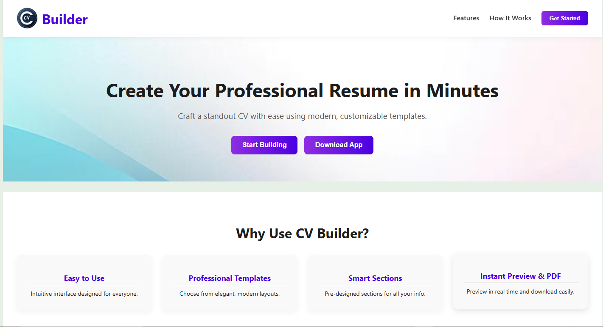
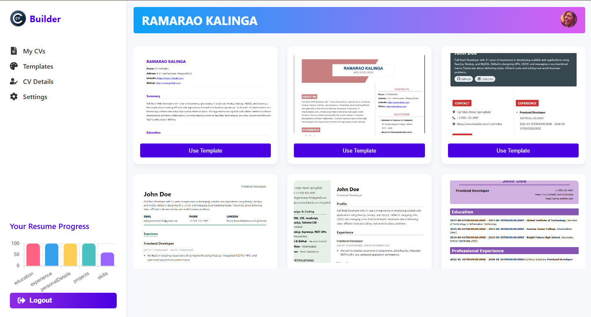
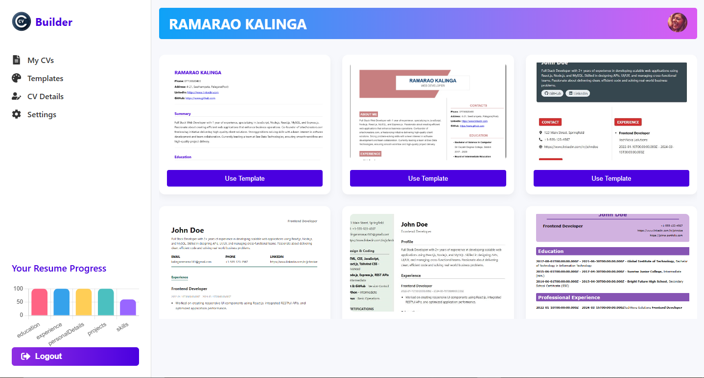
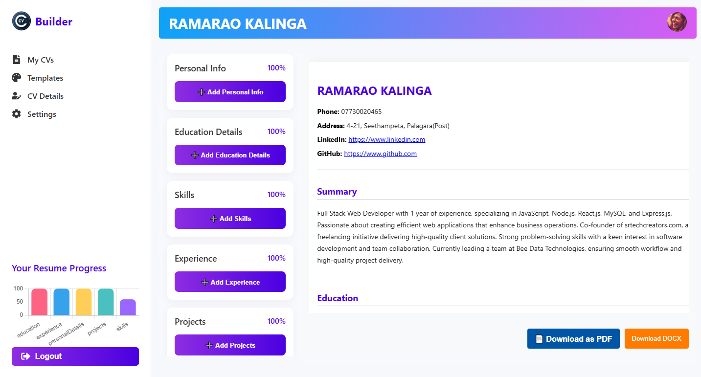

# 📝 CV Builder Web Application

A dynamic and user-friendly web application built with **React.js** (Frontend) and **Node.js** (Backend) that helps users create professional cv effortlessly. Users can input their information, select sections, get previews, and download cv in PDF format.

---

## 🚀 Features

- 👤 Add Personal Information (Name, Email, Phone, LinkedIn, GitHub, etc.)
- 🎓 Add Educational Details (Degree, Institution, Year, Grade)
- 💼 Add Work Experience (Company, Role, Duration, Description)
- 💡 Add Projects (Title, Tech Stack, Description, GitHub link)
- 🛠️ Add Skills (Categorized and Level-based)
- 🏆 Add Achievements and Certifications
- 🗣️ Add Extracurricular Activities, Hobbies, and References
- ✅ Preview Resume Before Download
- 📄 Generate and Download Resume as PDF
- 🎨 Section Selector: Choose which sections to include
- 🔒 Login/Registration system with authentication
- 📦 Backend APIs for saving and retrieving resume data

---

## 🧰 Tech Stack

| Layer        | Technology         |
|--------------|--------------------|
| Frontend     | React.js, CSS3     |
| Backend      | Node.js / Python (Flask or FastAPI) |
| Database     | MongoDB / MySQL    |
| PDF Export   | html2pdf.js / jsPDF |
| Authentication | JWT & Cookies    |

---

## 📂 Project Structure

```
cv-builder/
├── client/             # React frontend
│   ├── components/
│   ├── forms/
│   ├── pages/
│   ├── utils/
│   └── App.js
├── server/             # Node.js or Python backend
│   ├── controllers/
│   ├── models/
│   ├── routes/
│   └── server.js
├── database/
│   └── cv_builder.sql   # MySQL Database File
├── public/
├── README.md
└── package.json
```

---

## 📸 Screenshots

> Add screenshots of the following:
 - Homepage
 - Resume Builder Dashboard
 - Templates
 - CV Forms

---

## 💡 Future Enhancements

- 📁 Multiple Resume Templates
- 🗂️ Save Multiple Resume Versions
- ✨ AI-based Suggestion Engine
- 📩 Share resume via email
- 🌐 Multi-language Support

---

## 🔧 Prerequisites

- Node.js and npm
- Git
- XAMPP (for MySQL database)
- MySQL enabled in XAMPP

---

## ⚙️ Setup Instructions

### 1. 📥 Clone the repository

```bash
git clone https://github.com/your-username/cv-builder.git
cd cv-builder
```

---

### 2. 📦 Install dependencies

#### For client (React)
```bash
cd client
npm install
```

#### For server (Node.js)
```bash
cd ../server
npm install
```

---

### 3. 🛢️ Set up the MySQL Database (XAMPP)

1. Start **Apache** and **MySQL** from the XAMPP control panel.
2. Open `http://localhost/phpmyadmin/` in your browser.
3. Create a new database named:

```
cv_builder

```

4. Import the SQL file:

- Go to the `Import` tab.
- Choose the file:  
  `cv-builder/database/cv_builder.sql`
- Click **Go** to import the tables.

---

### 4. ⚙️ Configure environment variables

In the `server/` folder, create a `.env` file and add the following:

```env
DB_HOST=localhost
DB_USER=root
DB_PASSWORD=
DB_NAME=cv_builder
PORT=5000
```

> Adjust `DB_USER` and `DB_PASSWORD` if your MySQL credentials are different.

---

### 5. ▶️ Run the Application

#### Start the backend server

```bash
cd server
npm start
```

> Runs at `http://localhost:5000`

#### Start the frontend React app

```bash
cd ../client
npm start
```

> Runs at `http://localhost:3000`

---

## 🌐 Access the App

Visit: [http://localhost:3000](http://localhost:3000)  
The frontend will communicate with the backend API running on port `5000`.

---

## 📂 Database File Location

You can find the database SQL file here:  
📁 `cv-builder/database/cv_builder.sql`

---

## 📬 Contact

If you have any questions or issues, feel free to contact:  
**BeeData Technologies** – [support@beedata.in](mailto:ramarao.teamweb@bedatatech.com)

---

## 📜 License

This project is licensed under the [MIT License](LICENSE).
